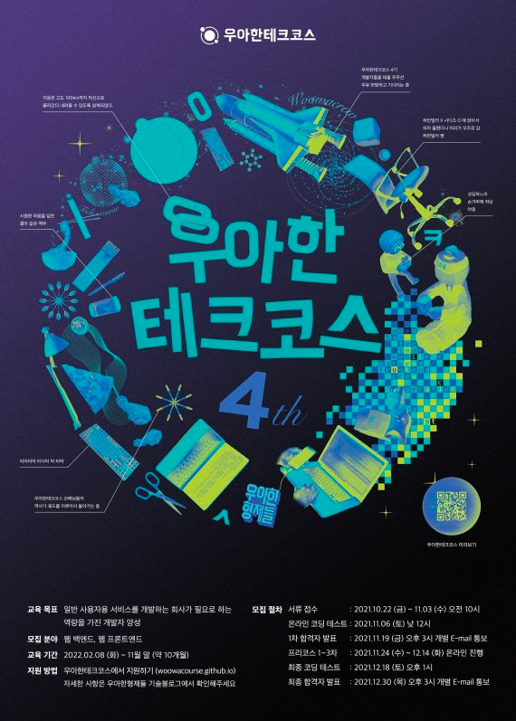

# 🚀 woowacourse-archive

    

> [우아한테크코스](https://woowacourse.github.io/) 우아한테크코스 4기에서 학습한 내용을 정리하는 저장소

 

## 🔮 Level 0 : 프리코스
### 기간
- 2021.11.24 – 2021.12.14

### 진행 미션
|  Project  |Repository |Pull Request |
|:---------:|:---------:|:-----------:|
| 숫자 야구 게임  |[java-baseball-precourse](https://github.com/Seongwon97/java-baseball-precourse/tree/Seongwon97)|[Pull Request](https://github.com/woowacourse/java-baseball-precourse/pull/397)|
| 자동차 경주 게임 |[java-racingcar-precourse](https://github.com/Seongwon97/java-racingcar-precourse/tree/Seongwon97)|[Pull Request](https://github.com/woowacourse/java-racingcar-precourse/pull/373)|
|    자판기    |[java-vendingmachine-precourse](https://github.com/Seongwon97/java-vendingmachine-precourse/tree/Seongwon)|[Pull Request](https://github.com/woowacourse/java-vendingmachine-precourse/pull/107)|

### 블로그 포스팅
- [Google Java Style Guide](https://seongwon.dev/Java/20211125-Google_Java_Style_Guide/)
- [Git 커밋 메세지 규약 정리 - The AngularJS commit conventions.](https://seongwon.dev/Git/20211125-Git%EC%BB%A4%EB%B0%8B%20%EB%A9%94%EC%8B%9C%EC%A7%80%20%EA%B7%9C%EC%95%BD/)
- [JUnit5로 단위 테스트하기](https://seongwon.dev/Java/20211127-Unit-Test%EB%9E%80/)
- [[우테코 프리코스] 1주차 과제 회고](https://seongwon.dev/Woowacourse/20211128-%EC%9A%B0%ED%85%8C%EC%BD%94-%ED%94%84%EB%A6%AC%EC%BD%94%EC%8A%A4-1%EC%A3%BC%EC%B0%A8-%EA%B3%BC%EC%A0%9C-%ED%9A%8C%EA%B3%A0/)
- [Private메서드의 Unit Test](https://seongwon.dev/Java/20211203-Private%EB%A9%94%EC%84%9C%EB%93%9C%EC%9D%98-Unit-Test/)
- [[우테코 프리코스] 2주차 과제 회고](https://seongwon.dev/Woowacourse/20211203-%EC%9A%B0%ED%85%8C%EC%BD%94-%ED%94%84%EB%A6%AC%EC%BD%94%EC%8A%A4-2%EC%A3%BC%EC%B0%A8-%EA%B3%BC%EC%A0%9C-%ED%9A%8C%EA%B3%A0/)
- [MVC패턴이란?](https://seongwon.dev/ETC/20211207_MVC%ED%8C%A8%ED%84%B4%EC%9D%B4%EB%9E%80/)
- [[우테코 프리코스] 2주차 피드백 정리](https://seongwon.dev/Woowacourse/20211210-%EC%9A%B0%ED%85%8C%EC%BD%94-%ED%94%84%EB%A6%AC%EC%BD%94%EC%8A%A4-2%EC%A3%BC%EC%B0%A8-%ED%94%BC%EB%93%9C%EB%B0%B1-%EC%A0%95%EB%A6%AC/)
- [일급 컬렉션이란?](https://seongwon.dev/Java/20211210-%EC%9D%BC%EA%B8%89_%EC%BB%AC%EB%A0%89%EC%85%98%EC%9D%B4%EB%9E%80/)
- [Enum이란?](https://seongwon.dev/Java/20211213-Enum%EC%9D%B4%EB%9E%80/)
- [싱글턴(Singleton) 패턴이란?](https://seongwon.dev/ETC/20211214_%EC%8B%B1%EA%B8%80%ED%84%B4%20%ED%8C%A8%ED%84%B4%EC%9D%B4%EB%9E%80/)
- [[우테코 프리코스] 3주차 과제 회고](https://seongwon.dev/Woowacourse/20211214-%EC%9A%B0%ED%85%8C%EC%BD%94-%ED%94%84%EB%A6%AC%EC%BD%94%EC%8A%A4-3%EC%A3%BC%EC%B0%A8-%EA%B3%BC%EC%A0%9C-%ED%9A%8C%EA%B3%A0/)
- [[우테코 프리코스] 프리코스 참여후기](https://seongwon.dev/Woowacourse/20211214-%EC%9A%B0%ED%85%8C%EC%BD%94-%ED%94%84%EB%A6%AC%EC%BD%94%EC%8A%A4-%EC%B0%B8%EC%97%AC%ED%9B%84%EA%B8%B0/)

 

## 🔮 Level 0.5 : 최종 코딩 테스트
### 기간
- 2021.12.18

### 진행 미션
|     Project      |Repository |Pull Request |
|:----------------:|:---------:|:-----------:|
| 페어매칭관리 애플리케이션 미션 |[java-pairmatching-precourse](https://github.com/Seongwon97/java-pairmatching-precourse/tree/Seongwon97)|[Pull Request](https://github.com/woowacourse/java-pairmatching-precourse/pull/105)|

### 블로그 포스팅
- [[우테코] 최종 코딩테스트 대비-1](https://seongwon.dev/Woowacourse/20211216-%EC%9A%B0%ED%85%8C%EC%BD%94-%EC%B5%9C%EC%A2%85-%EC%BD%94%EB%94%A9%ED%85%8C%EC%8A%A4%ED%8A%B8-%EB%8C%80%EB%B9%841/)
- [[우테코] 최종 코딩테스트 대비-2](https://seongwon.dev/Woowacourse/20211217-%EC%9A%B0%ED%85%8C%EC%BD%94-%EC%B5%9C%EC%A2%85-%EC%BD%94%EB%94%A9%ED%85%8C%EC%8A%A4%ED%8A%B8-%EB%8C%80%EB%B9%842/)
- [[우테코] 최종 코딩테스트 후기](https://seongwon.dev/Woowacourse/20211218-%EC%9A%B0%ED%85%8C%EC%BD%94-%EC%B5%9C%EC%A2%85-%EC%BD%94%EB%94%A9%ED%85%8C%EC%8A%A4%ED%8A%B8-%ED%9B%84%EA%B8%B0/)
- [[우테코] 최종 결과](https://seongwon.dev/Woowacourse/20211231-%EC%9A%B0%ED%85%8C%EC%BD%94-%EC%B5%9C%EC%A2%85-%EA%B2%B0%EA%B3%BC/)

 

## 🌘 Level 1 : TDD, OOP, 상속﹒인터페이스의 이해, Refactoring, Clean Code, 웹﹒DB
### 기간
- 2022.02.08 – 2022.04.08

### 진행 미션
|     Project     |                                         Repository                                          |Pull Request |                Pair                 |             Reviewer              |
|:---------------:|:-------------------------------------------------------------------------------------------:|:-----------:|:-----------------------------------:|:---------------------------------:|
| 자동차 경주 게임/step1 |       [java-racingcar/step1](https://github.com/Seongwon97/java-racingcar/tree/step1)       |[Pull Request](https://github.com/woowacourse/java-racingcar/pull/326)|  [스컬](https://github.com/skullkim)  | [미르](https://github.com/ddu0422)  |
| 자동차 경주 게임/step2 |       [java-racingcar/step2](https://github.com/Seongwon97/java-racingcar/tree/step2)       |[Pull Request](https://github.com/woowacourse/java-racingcar/pull/373)|                                     | [미르](https://github.com/ddu0422)  |
|    로또/step1     |           [java-lotto/step1](https://github.com/Seongwon97/java-lotto/tree/step1)           |[Pull Request](https://github.com/woowacourse/java-lotto/pull/390)|  [써머](https://github.com/hyewoncc)  |  [코니](https://github.com/choihz)  |
|    로또/step2     |           [java-lotto/step2](https://github.com/Seongwon97/java-lotto/tree/step2)           |[Pull Request](https://github.com/woowacourse/java-lotto/pull/471)|                                     |  [코니](https://github.com/choihz)  |
|    블랙잭/step1    |       [java-blackjack/step1](https://github.com/Seongwon97/java-blackjack/tree/step1)       |[Pull Request](https://github.com/woowacourse/java-blackjack/pull/257)| [라쿤](https://github.com/nbalance97) |  [철시](https://github.com/pkch93)  |
|    블랙잭/step2    |       [java-blackjack/step2](https://github.com/Seongwon97/java-blackjack/tree/step2)       |[Pull Request](https://github.com/woowacourse/java-blackjack/pull/311)|                                     |  [철시](https://github.com/pkch93)  |
|  체스/step1,2,3   |         [java-chess/step1,2,3](https://github.com/Seongwon97/java-chess/tree/step1)         |[Pull Request](https://github.com/woowacourse/java-chess/pull/301)| [차리](https://github.com/cjlee38)  | [범블비](https://github.com/ddaaac) |
|   체스/step4,5    |          [java-chess/step4,5](https://github.com/Seongwon97/java-chess/tree/step2)          |[Pull Request](https://github.com/woowacourse/java-chess/pull/372)|                                     | [범블비](https://github.com/ddaaac)  |

### 블로그 포스팅
- [Git이란?](https://seongwon.dev/Git/20220217-Git%EC%9D%B4%EB%9E%80/)
- [[우아한테크코스] 레벨1 자동차경주 미션 피드백 정리](https://seongwon.dev/Woowacourse/20220221-%EC%9A%B0%ED%85%8C%EC%BD%94-%EB%A0%88%EB%B2%A81-%EC%9E%90%EB%8F%99%EC%B0%A8%EA%B2%BD%EC%A3%BC-%ED%94%BC%EB%93%9C%EB%B0%B1%EC%A0%95%EB%A6%AC/)
- [[우아한테크코스] 레벨1 자동차경주 미션 회고 (2월 9일 ~ 21일)](https://seongwon.dev/Woowacourse/20220221-%EC%9A%B0%ED%85%8C%EC%BD%94-%EB%A0%88%EB%B2%A81-%EC%9E%90%EB%8F%99%EC%B0%A8%EA%B2%BD%EC%A3%BC-%ED%9A%8C%EA%B3%A0/)
- [[Effective Java] Item1. 생성자 대신 정적 팩터리 메서드를 고려하라](https://seongwon.dev/Java/20220222-%EC%9D%B4%ED%8E%99%ED%8B%B0%EB%B8%8C%EC%9E%90%EB%B0%94-1-%EC%83%9D%EC%84%B1%EC%9E%90%EB%8C%80%EC%8B%A0-%EC%A0%95%EC%A0%81%ED%8E%99%ED%86%A0%EB%A6%AC-%EB%A9%94%EC%84%9C%EB%93%9C/)
- [[Effective Java] Item2. 생성자에 매개변수가 많다면 빌더를 고려하라](https://seongwon.dev/Java/20220223-%EC%9D%B4%ED%8E%99%ED%8B%B0%EB%B8%8C%EC%9E%90%EB%B0%94-2-%EC%83%9D%EC%84%B1%EC%9E%90%EC%97%90-%EB%A7%A4%EA%B0%9C%EB%B3%80%EC%88%98%EA%B0%80-%EB%A7%8E%EB%8B%A4%EB%A9%B4-%EB%B9%8C%EB%8D%94%EB%A5%BC-%EA%B3%A0%EB%A0%A4%ED%95%98%EB%9D%BC/)
- [String 파헤치기](https://seongwon.dev/Java/20220225-String-%EB%82%B4%EB%B6%80-%ED%8C%8C%ED%97%A4%EC%B9%98%EA%B8%B0/)
- [자바의 final](https://seongwon.dev/Java/20220227-%EC%9E%90%EB%B0%94%EC%9D%98-Final/)
- [자바에서 큰 숫자를 가독성 좋게 하는 방법](https://seongwon.dev/Java/20220228-%ED%81%B0-%EC%88%AB%EC%9E%90%EC%9D%98-%EC%96%B8%EB%8D%94%EC%8A%A4%EC%BD%94%EC%96%B4/)
- [제너릭(Generic)이란?](https://seongwon.dev/Java/20220228-%EC%A0%9C%EB%84%88%EB%A6%AD%EC%9D%B4%EB%9E%80/)
- [[Effective Java] Item3. private 생성자나 열거 타입으로 싱글턴임을 보증하라](https://seongwon.dev/Java/20220228-%EC%9D%B4%ED%8E%99%ED%8B%B0%EB%B8%8C%EC%9E%90%EB%B0%94-3-%EC%8B%B1%EA%B8%80%ED%84%B4%EC%9E%84%EC%9D%84-%EB%B3%B4%EC%A6%9D%ED%95%98%EB%9D%BC/)
- [[Effective Java] Item4. 인스턴스화를 막으려거든 private 생성자를 사용하라](https://seongwon.dev/Java/20220228-%EC%9D%B4%ED%8E%99%ED%8B%B0%EB%B8%8C%EC%9E%90%EB%B0%94-4/)
- [utils의 이해 & 제너릭 인터페이스를 활용한 예외처리](https://seongwon.dev/Java/20220302-%EC%A0%9C%EB%84%88%EB%A6%AD-%EC%9D%B8%ED%84%B0%ED%8E%98%EC%9D%B4%EC%8A%A4%EB%A5%BC-%ED%99%9C%EC%9A%A9%ED%95%9C-%EC%98%88%EC%99%B8%EC%B2%98%EB%A6%AC/)
- [동등성과 동일성](https://seongwon.dev/Java/20220302-%EB%8F%99%EB%93%B1%EC%84%B1%EA%B3%BC-%EB%8F%99%EC%9D%BC%EC%84%B1/)
- [[Effective Java] Item5. 자원을 직접 명시하지 말고 의존 객체 주입을 사용하라.](https://seongwon.dev/Java/20220303-%EC%9D%B4%ED%8E%99%ED%8B%B0%EB%B8%8C%EC%9E%90%EB%B0%94-5/)
- [No newline at a end of file, 파일의 끝에는 개행 추가❗️](https://seongwon.dev/Git/20220303-%ED%8C%8C%EC%9D%BC%EC%9D%98_%EB%A7%88%EC%A7%80%EB%A7%89_%EA%B0%9C%ED%96%89/)
- [[Effective Java] Item6. 불필요한 객체 생성을 피하라](https://seongwon.dev/Java/20220304-%EC%9D%B4%ED%8E%99%ED%8B%B0%EB%B8%8C%EC%9E%90%EB%B0%94-6/)
- [[Effective Java] Item7. 다 쓴 객체 참조를 해체하라](https://seongwon.dev/Java/20220304-%EC%9D%B4%ED%8E%99%ED%8B%B0%EB%B8%8C%EC%9E%90%EB%B0%94-7/)
- [Git Branch 전략](https://seongwon.dev/Git/20220305-Git-Branch%EC%A0%84%EB%9E%B5/)
- [[우아한테크코스] 레벨1 로또 미션 피드백 정리](https://seongwon.dev/Woowacourse/20220307-%EC%9A%B0%ED%85%8C%EC%BD%94-%EB%A0%88%EB%B2%A81-%EB%A1%9C%EB%98%90-%ED%94%BC%EB%93%9C%EB%B0%B1%EC%A0%95%EB%A6%AC/)
- [[우아한테크코스] 레벨1 로또 미션 회고 (2월 22일 ~ 3월 7일)](https://seongwon.dev/Woowacourse/20220307-%EC%9A%B0%ED%85%8C%EC%BD%94-%EB%A0%88%EB%B2%A81-%EB%A1%9C%EB%98%90-%ED%9A%8C%EA%B3%A0/)
- [자바의 상속](https://seongwon.dev/Java/20220311-%EC%9E%90%EB%B0%94-%EC%83%81%EC%86%8D/)
- [자바의 인터페이스](https://seongwon.dev/Java/20220312-%EC%9E%90%EB%B0%94%EC%9D%98-%EC%9D%B8%ED%84%B0%ED%8E%98%EC%9D%B4%EC%8A%A4/)
- [[Effective Java] Item9. try-finally보다는 try-with-resources를 사용하라](https://seongwon.dev/Java/20220312-%EC%9D%B4%ED%8E%99%ED%8B%B0%EB%B8%8C%EC%9E%90%EB%B0%94-9/)
- [[Effective Java] Item10. equals는 일반 규약을 지켜 재정의하라](https://seongwon.dev/Java/20220314-%EC%9D%B4%ED%8E%99%ED%8B%B0%EB%B8%8C%EC%9E%90%EB%B0%94-10/)
- [[Effective Java] Item11. equals를 재정의하려거든 hashCode도 재정의하라](https://seongwon.dev/Java/20220314-%EC%9D%B4%ED%8E%99%ED%8B%B0%EB%B8%8C%EC%9E%90%EB%B0%94-11/)
- [[Effective Java] Item12. toString을 항상 재정의하라](https://seongwon.dev/Java/20220314-%EC%9D%B4%ED%8E%99%ED%8B%B0%EB%B8%8C%EC%9E%90%EB%B0%94-12-toString%EC%9E%AC%EC%A0%95%EC%9D%98/)
- [[Effective Java] Item13. clone 재정의는 주의해서 진행하라](https://seongwon.dev/Java/20220315-%EC%9D%B4%ED%8E%99%ED%8B%B0%EB%B8%8C%EC%9E%90%EB%B0%94-13/)
- [[Effective Java] Item14. Comparable을 구현할지 고려하라](https://seongwon.dev/Java/20220316-%EC%9D%B4%ED%8E%99%ED%8B%B0%EB%B8%8C%EC%9E%90%EB%B0%94-14/)
- [[Effective Java] Item15. 클래스와 멤버의 접근 권한을 최소화하라](https://seongwon.dev/Java/20220316-%EC%9D%B4%ED%8E%99%ED%8B%B0%EB%B8%8C%EC%9E%90%EB%B0%94-15/)
- [[Effective Java] Item16. public 클래스에서는 public 필드가 아닌 접근자 메서드를 사용하라](https://seongwon.dev/Java/20220317-%EC%9D%B4%ED%8E%99%ED%8B%B0%EB%B8%8C%EC%9E%90%EB%B0%94-16/)
- [[Effective Java] Item17. 변경 가능성을 최소화하라](https://seongwon.dev/Java/20220317-%EC%9D%B4%ED%8E%99%ED%8B%B0%EB%B8%8C%EC%9E%90%EB%B0%94-17/)
- [[우아한테크코스] 레벨1 블랙잭 미션 피드백 정리](https://seongwon.dev/Woowacourse/20220321-%EC%9A%B0%ED%85%8C%EC%BD%94-%EB%A0%88%EB%B2%A81-%EB%B8%94%EB%9E%99%EC%9E%AD-%ED%94%BC%EB%93%9C%EB%B0%B1%EC%A0%95%EB%A6%AC/)
- [[우아한테크코스] 레벨1 블랙잭 미션 회고 (3월 8일 ~ 21일)](https://seongwon.dev/Woowacourse/20220321-%EC%9A%B0%ED%85%8C%EC%BD%94-%EB%A0%88%EB%B2%A81-%EB%B8%94%EB%9E%99%EC%9E%AD-%ED%9A%8C%EA%B3%A0/)
- [[Git] 미션 코드로 잔디 심기](https://seongwon.dev/Git/20220323-%EB%AF%B8%EC%85%98%EC%BD%94%EB%93%9C%EB%A1%9C-%EC%9E%94%EB%94%94%EC%8B%AC%EA%B8%B0/)

 

## 🌗 Level 2 : Spring Framework, Deployment, Infrastructure
### 기간
- 2022.04.19 – 2022.06.10

### 진행 미션
|        Project         |                                        Repository                                        |Pull Request |                 Pair                  |               Reviewer               |
|:----------------------:|:----------------------------------------------------------------------------------------:|:-----------:|:-------------------------------------:|:------------------------------------:|
|    Spring 체스/step1     |          [jwp-chess/step1](https://github.com/Seongwon97/jwp-chess/tree/step1)           |[Pull Request](https://github.com/woowacourse/jwp-chess/pull/395)|    [슬로](https://github.com/hanull)    |  [럿고](https://github.com/ksy90101)   |
|    Spring 체스/step2     |          [jwp-chess/step2](https://github.com/Seongwon97/jwp-chess/tree/step2)           |[Pull Request](https://github.com/woowacourse/jwp-chess/pull/461)|                                       |  [럿고](https://github.com/ksy90101)   |
| Spring 지하철 노선도/step1,2 |   [atdd-subway-map/step1,2](https://github.com/Seongwon97/atdd-subway-map/tree/step2)    |[Pull Request](https://github.com/woowacourse/atdd-subway-map/pull/229)|   [토닉](https://github.com/tonic523)   |   [코니](https://github.com/choihz)    |
|  Spring 지하철 노선도/step3  |    [atdd-subway-map/step3](https://github.com/Seongwon97/atdd-subway-map/tree/step3)     |[Pull Request](https://github.com/woowacourse/atdd-subway-map/pull/279)|                                       |   [코니](https://github.com/choihz)    |
|   Spring 경로 조회/step1   |   [atdd-subway-path/step1](https://github.com/Seongwon97/atdd-subway-path/tree/step1)    |[Pull Request](https://github.com/woowacourse/atdd-subway-path/pull/210)| [필즈](https://github.com/progress0407) | [루피](https://github.com/TheDevLuffy) |
|   Spring 경로 조회/step2   |   [atdd-subway-path/step2](https://github.com/Seongwon97/atdd-subway-path/tree/step2)    |[Pull Request](https://github.com/woowacourse/atdd-subway-path/pull/263)|                                       | [루피](https://github.com/TheDevLuffy) |
|   Spring 장바구니/step1    |  [jwp-shopping-cart/step1](https://github.com/Seongwon97/jwp-shopping-cart/tree/step1)   |[Pull Request](https://github.com/woowacourse/jwp-shopping-cart/pull/25)|  [아리](https://github.com/ulimy)   |   [에단](https://github.com/Laterality)   |
|   Spring 장바구니/step2    |  [jwp-shopping-cart/step2](https://github.com/Seongwon97/jwp-shopping-cart/tree/step2)   |[Pull Request](https://github.com/woowacourse/jwp-shopping-cart/pull/121)|                                       |   [에단](https://github.com/Laterality)   |

### 블로그 포스팅
- [[Spring] GetMapping](https://seongwon.dev/Spring/20220421-Spring-Get-Mapping/)
- [[Spring] PostMapping](https://seongwon.dev/Spring/20220422-Spring-Post-Mapping/)
- [[Spring] DI,IoC란 무엇일까?](https://seongwon.dev/Spring/20220614-%EC%8A%A4%ED%94%84%EB%A7%81-DI-IoC/)
- [[Spring] - @RequestParam, @RequestBody, @ModelAndAttribute 차이 비교](https://seongwon.dev/Spring/20220615-RequestParam-RequestBody-ModelAndAttribute%EB%B9%84%EA%B5%90/)
- [[Spring] Bean이란 무엇일까?](https://seongwon.dev/Spring/20220616-%EC%8A%A4%ED%94%84%EB%A7%81-Bean/)
- [[Spring] 자동 주입과 여러 주입 방법](https://seongwon.dev/Spring/20220619-%EC%9E%90%EB%8F%99%EC%A3%BC%EC%9E%85%EA%B3%BC-%EC%97%AC%EB%9F%AC%EC%A3%BC%EC%9E%85%EB%B0%A9%EB%B2%95/)
- [[Spring] Servlet이란?](https://seongwon.dev/Spring/20220620-Servlet%EC%9D%B4%EB%9E%80/)
- [[Spring] MVC 동작 방식 이해하기](https://seongwon.dev/Spring/20220621-%EC%8A%A4%ED%94%84%EB%A7%81MVC-%EB%8F%99%EC%9E%91%EB%B0%A9%EC%8B%9D/)
- [[Spring] Lombok 이란?](https://seongwon.dev/Spring/20220621-Lombok%EC%9D%B4%EB%9E%80/)
- [[Spring] @RestController와 @Controller 비교하기](https://seongwon.dev/Spring/20220621-Controller%EC%99%80RestController%EC%B0%A8%EC%9D%B4/)
- [[Spring] Validation Annotation이란? + DTO에서는 어디까지 검증해야할까?](https://seongwon.dev/Spring/20220622-Valid%EB%9E%80/)
- [[Spring 테스트] @SpringBootTest를 이용해 통합 테스트하기](https://seongwon.dev/Spring/20220623-SpringBootTest%EC%96%B4%EB%85%B8%ED%85%8C%EC%9D%B4%EC%85%98-%ED%95%99%EC%8A%B5%ED%95%98%EA%B8%B0/)
- [[Spring 테스트] MockMvc란 무엇일까?](https://seongwon.dev/Spring/20220624-MockMvc%EB%9E%80/)
- [[Spring] Filter란 무엇일까?](https://seongwon.dev/Spring/20220625-Filter%EB%9E%80/)
- [[Spring] 우리는 왜 스프링을 사용하는가?](https://seongwon.dev/Spring/20220627-%EC%9A%B0%EB%A6%AC%EB%8A%94-%EC%99%9C-%EC%8A%A4%ED%94%84%EB%A7%81%EC%9D%84-%EC%82%AC%EC%9A%A9%ED%95%A0%EA%B9%8C/)
- [[Spring] Interceptor란 무엇일까?](https://seongwon.dev/Spring/20220626-Interceptor%EB%9E%80/)
- [[Spring] Filter와 Interceptor의 차이 비교](https://seongwon.dev/Spring/20220627-Filter%EC%99%80Interceptor%EC%B0%A8%EC%9D%B4/)
- [Framework vs Library (feat. IoC, 왜 프레임워크를 써야할까?)](https://seongwon.dev/ETC/20220627-Framework-vs-Library/)
- [[Spring] Spring과 Spring Boot의 차이는 무엇일까?](https://seongwon.dev/Spring/20220628-Spring-vs-SpringBoot/)
- [[Spring] ArgumentResolver란 무엇일까?](https://seongwon.dev/Spring/20220629-ArgumentResolver%EB%9E%80/)

 

## 🌖 Level 3 : Team Project
### 기간
- 2022.06.28 – 2022.10.21

### 프로젝트 Repository
- [모두 모여라(MOMO)](https://github.com/woowacourse-teams/2022-momo)

### 사이트 바로가기
- [모두 모여라 사이트](https://www.moyeora.site/)
- [모모팀 기술 블로그](https://2022-momo.github.io/)

#### 프로젝트 데모 영상
- [프로젝트 1차 데모 - 팀 소개, 프로젝트 소개, 팀 문화, Github활용 방법](https://www.youtube.com/watch?v=-86HlsrqgJY)
- [프로젝트 2차 데모 - 완료한 업무 목록, 브랜치 전략, API 관리 방법, 배포 과정, 서비스 데모](https://www.youtube.com/watch?v=FvhTuj_Cxvk)
- [프로젝트 3차 데모 - 완료한 업무 목록, Logging, HTTPS, 변경된 인프라, 시멘틱 버저닝, 서비스 데모](https://www.youtube.com/watch?v=W5Rloao4zuQ&t=270s)

### 블로그 포스팅
- [[JPA] JPA란?](https://seongwon.dev/Spring/20220705-JPA%EB%9E%80/)
- [[JPA] 엔티티 생명주기와 영속성 컨텍스트](https://seongwon.dev/Spring/20220706-%EC%97%94%ED%8B%B0%ED%8B%B0-%EC%83%9D%EB%AA%85%EC%A3%BC%EA%B8%B0%EC%99%80-%EC%98%81%EC%86%8D%EC%84%B1-%EC%BB%A8%ED%85%8D%EC%8A%A4%ED%8A%B8/)
- [CI/CD란?](https://seongwon.dev/DevOps/20220713-CICD%EB%9E%80/)
- [[DevOps] Jenkins를 통한 CI/CD 구축기 1편 (Jenkins 설치)](https://seongwon.dev/DevOps/20220715-CICD%EA%B5%AC%EC%B6%95%EA%B8%B01/)
- [[DevOps] Jenkins를 통한 CI/CD 구축기 2편 (Backend CI/CD 구축)](https://seongwon.dev/DevOps/20220717-CICD%EA%B5%AC%EC%B6%95%EA%B8%B02/)
- [[DevOps] Jenkins를 통한 CI/CD 구축기 3편 (Frontend CI/CD 구축)](https://seongwon.dev/DevOps/20220728-CICD%EA%B5%AC%EC%B6%95%EA%B8%B03/)
- [[Git] Submodule이란?](https://seongwon.dev/Git/20220811-Git%20Submodule%EC%9D%B4%EB%9E%80/)
- [[AWS, MySQL] - Private Ec2에 MySQL설치 및 원격 접속 설정하기](https://seongwon.dev/DevOps/20220813-MySQL%EC%84%A4%EC%B9%98_%EC%9B%90%EA%B2%A9%EC%A0%91%EC%86%8D%EC%84%A4%EC%A0%95/)
- [[DevOps] Jenkins를 통한 CI/CD 구축기 4편 (Backend DB 구축)](https://seongwon.dev/DevOps/20220814-CICD%EA%B5%AC%EC%B6%95%EA%B8%B04/)
- [[JPA] JPA Specification(Criteria)을 통한 조회 필터링 기능 구현](https://seongwon.dev/Spring/20220817-JPA-Specification/)
- [[Spring] Spring Profile을 통한 실행 환경 분리](https://seongwon.dev/Spring/20220821-%EC%8A%A4%ED%94%84%EB%A7%81-Profile%EC%9D%B4%EB%9E%80/)
- [[JPA] 엔티티(Entity) 매핑](https://seongwon.dev/Spring/20220823-JPA-%EC%97%94%ED%8B%B0%ED%8B%B0%EB%A7%A4%ED%95%91/)
- [[JPA] 엔티티간 연관관계](https://seongwon.dev/Spring/20220824-JPA-%EC%97%94%ED%8B%B0%ED%8B%B0%EA%B0%84_%EC%97%B0%EA%B4%80%EA%B4%80%EA%B3%84/)
- [[JPA] 프록시와 지연로딩](https://seongwon.dev/Spring/20220825-JPA-%ED%94%84%EB%A1%9D%EC%8B%9C%EC%99%80-%EC%A7%80%EC%97%B0%EB%A1%9C%EB%94%A9/)
- [[JPA] 영속성 전이와 고아객체](https://seongwon.dev/Spring/20220826-JPA-%EC%98%81%EC%86%8D%EC%84%B1_%EC%A0%84%EC%9D%B4%EC%99%80_%EA%B3%A0%EC%95%84%EA%B0%9D%EC%B2%B4/)
- [[JPA] JPQL이란?](https://seongwon.dev/Spring/20220829-JPA-JPQL/)
- [[JPA] Spring Data JPA란?](https://seongwon.dev/Spring/20220911-Spring-Data-JPA%EB%9E%80/)
- [[JPA] Spring Data JPA의 Query Method](https://seongwon.dev/Spring/20220913-Query-Method%EB%9E%80/)
- [성능테스트, 부하테스트, 스트레스 테스트..무엇이 다를까?](https://seongwon.dev/ETC/20220919-%EC%84%B1%EB%8A%A5%ED%85%8C%EC%8A%A4%ED%8A%B8-%EB%B6%80%ED%95%98%ED%85%8C%EC%8A%A4%ED%8A%B8-%EC%8A%A4%ED%8A%B8%EB%A0%88%EC%8A%A4%ED%85%8C%EC%8A%A4%ED%8A%B8%EB%9E%80/)
- [Fetch Join과 limit을 같이 사용하며 발생한 문제 - [WARN] firstResult/maxResults specified with collection fetch; applying in memory!](https://seongwon.dev/Spring/20220930-FetchJoin%EA%B3%BC-limit%EC%9D%84-%EA%B0%99%EC%9D%B4-%EC%82%AC%EC%9A%A9%ED%95%98%EB%A9%B0-%EB%B0%9C%EC%83%9D%ED%95%9C-%EB%AC%B8%EC%A0%9C/)
- [[Spring] Spring의 Event란 무엇일까?](https://seongwon.dev/Spring/20221008-Spring%EC%9D%98_Event/)
- [모모팀 서비스 성능 개선기1 (의존관계 개선)](https://seongwon.dev/Spring/20221009-%EB%AA%A8%EB%AA%A8%ED%8C%80-%EC%84%9C%EB%B9%84%EC%8A%A4%EC%84%B1%EB%8A%A5-%EA%B0%9C%EC%84%A0%EA%B8%B01/)
- [모모팀 서비스 성능 개선기2 (조회 쿼리 개선)](https://seongwon.dev/Spring/20221014-%EB%AA%A8%EB%AA%A8%ED%8C%80-%EC%84%9C%EB%B9%84%EC%8A%A4%EC%84%B1%EB%8A%A5-%EA%B0%9C%EC%84%A0%EA%B8%B02/)
- [모모팀 서비스 성능 개선기3 (CUD 쿼리 개선)](https://seongwon.dev/Spring/20221017-%EB%AA%A8%EB%AA%A8%ED%8C%80-%EC%84%9C%EB%B9%84%EC%8A%A4%EC%84%B1%EB%8A%A5-%EA%B0%9C%EC%84%A0%EA%B8%B03/)
- [모모팀 서비스 성능 개선 결과 (성능 테스트)](https://seongwon.dev/Spring/20221020-%EB%AA%A8%EB%AA%A8%ED%8C%80-%EC%84%9C%EB%B9%84%EC%8A%A4%EC%84%B1%EB%8A%A5-%EA%B0%9C%EC%84%A0%EA%B2%B0%EA%B3%BC/)
- [Docker 🐳란 무엇일까?](https://seongwon.dev/DevOps/20221020-Docker%EB%9E%80/)
- [모모팀 인프라 개선기 1편 (Docker🐳 도입)](https://seongwon.dev/DevOps/20221021-%EB%AA%A8%EB%AA%A8%ED%8C%80-%EC%9D%B8%ED%94%84%EB%9D%BC-%EA%B0%9C%EC%84%A0%EA%B8%B0-1%ED%8E%B8/)
- [모모팀 인프라 개선기 2편 (로드 밸런싱 도입)](https://seongwon.dev/DevOps/20221023-%EB%AA%A8%EB%AA%A8%ED%8C%80-%EC%9D%B8%ED%94%84%EB%9D%BC-%EA%B0%9C%EC%84%A0%EA%B8%B0-2%ED%8E%B8/)
- [모모팀 인프라 개선기 3편 (무중단 배포)](https://seongwon.dev/DevOps/20221026-%EB%AA%A8%EB%AA%A8%ED%8C%80-%EC%9D%B8%ED%94%84%EB%9D%BC-%EA%B0%9C%EC%84%A0%EA%B8%B0-3%ED%8E%B8/)

 

## 🌕 Level 4 : HTTP Server, MVC Framework, JDBC Template
### 기간
- 2022.08.30 – 2022.10.28

### 진행 미션
|        Project        |                                       Repository                                        |Pull Request |Reviewer |
|:---------------------:|:---------------------------------------------------------------------------------------:|:-----------:|:-------:|
|     톰캣 구현하기/step1     | [jwp-dashboard-http/step1](https://github.com/Seongwon97/jwp-dashboard-http/tree/step1) |[Pull Request](https://github.com/woowacourse/jwp-dashboard-http/pull/130)|[토닉](https://github.com/tonic523)|
|     톰캣 구현하기/step2     | [jwp-dashboard-http/step2](https://github.com/Seongwon97/jwp-dashboard-http/tree/step2) |[Pull Request](https://github.com/woowacourse/jwp-dashboard-http/pull/200)|[토닉](https://github.com/tonic523)|
|    톰캣 구현하기/step3,4    | [jwp-dashboard-http/step3,4](https://github.com/Seongwon97/jwp-dashboard-http/tree/step3%2C4)  |[Pull Request](https://github.com/woowacourse/jwp-dashboard-http/pull/249)|[토닉](https://github.com/tonic523)|
|    MVC 구현하기/step1    | [jwp-dashboard-mvc/step1](https://github.com/Seongwon97/jwp-dashboard-mvc/tree/step1)  |[Pull Request](https://github.com/woowacourse/jwp-dashboard-mvc/pull/127)|[썬](https://github.com/syoun602)|
|    MVC 구현하기/step2    | [jwp-dashboard-mvc/step2](https://github.com/Seongwon97/jwp-dashboard-mvc/tree/step2)  |[Pull Request](https://github.com/woowacourse/jwp-dashboard-mvc/pull/215)|[썬](https://github.com/syoun602)|
|    MVC 구현하기/step3    | [jwp-dashboard-mvc/step3](https://github.com/Seongwon97/jwp-dashboard-mvc/tree/step3)  |[Pull Request](https://github.com/woowacourse/jwp-dashboard-mvc/pull/300)|[썬](https://github.com/syoun602)|
|    JDBC 라이브러리 구현하기/step1    | [jwp-dashboard-jdbc/step1](https://github.com/Seongwon97/jwp-dashboard-jdbc/tree/step1)  |[Pull Request](https://github.com/woowacourse/jwp-dashboard-jdbc/pull/71)|[연로그](https://github.com/yeon-06)|
|    JDBC 라이브러리 구현하기/step2    | [jwp-dashboard-jdbc/step1](https://github.com/Seongwon97/jwp-dashboard-jdbc/tree/step2)  |[Pull Request](https://github.com/woowacourse/jwp-dashboard-jdbc/pull/155)|[연로그](https://github.com/yeon-06)|
|    JDBC 라이브러리 구현하기/step3    | [jwp-dashboard-jdbc/step1](https://github.com/Seongwon97/jwp-dashboard-jdbc/tree/step3)  |[Pull Request](https://github.com/woowacourse/jwp-dashboard-jdbc/pull/200)|[연로그](https://github.com/yeon-06)|

### 블로그 포스팅
- [트랜잭션이란?](https://seongwon.dev/Database/20221001-%ED%8A%B8%EB%9E%9C%EC%9E%AD%EC%85%98%EC%9D%B4%EB%9E%80/)
- [DB Connection Pool (DBCP) (feat.HikariCP)](https://seongwon.dev/Database/20221002-DB_Connection_Pool/)
- [트랜잭션의 격리수준(Isolation level)이란?](https://seongwon.dev/Database/20221022-%ED%8A%B8%EB%9E%9C%EC%9E%AD%EC%85%98-%EA%B2%A9%EB%A6%AC%EC%88%98%EC%A4%80%EC%9D%B4%EB%9E%80/)

 

## 🖋 Writing : 글쓰기 코스
### 진행 미션
| Level  |        Topic         |                                         Writing                                         |                                           Pull Request                                            |
|:------:|:--------------------:|:---------------------------------------------------------------------------------:|:-------------------------------------------------------------------------------------------------:|
| 1 - 기록 |   우아한테크코스 한 달 생활기    | [편하게 보기](https://github.com/Seongwon97/woowa-writing-4/blob/seongwon97/Level1.md) |              [Pull Request](https://github.com/woowacourse/woowa-writing-4/pull/39)               |
| 2 - 성장 |우테코에서 찾은 나만의 효과적인 공부법 |   [편하게 보기](https://github.com/Seongwon97/woowa-writing-4/blob/step2/Level2.md)    |              [Pull Request](https://github.com/woowacourse/woowa-writing-4/pull/169)              |
| 3 - 회고 |   팀 프로젝트가 나에게 남긴 것   |   [편하게 보기](https://github.com/Seongwon97/woowa-writing-4/blob/step3/Level3.md)    |              [Pull Request](https://github.com/woowacourse/woowa-writing-4/pull/252)              |
| 4 - 시작 |   내가 꿈꾸는 프로그래머로서의 삶   |   [편하게 보기](https://github.com/Seongwon97/woowa-writing-4/blob/step4/Level4.md)    |              [Pull Request](https://github.com/woowacourse/woowa-writing-4/pull/373)              |

 

## 🎙 10분 테코톡
- [[10분 테코톡] 렉스의 Git 브랜칭 전략](https://www.youtube.com/watch?v=wtsr5keXUyE&t=25s)
